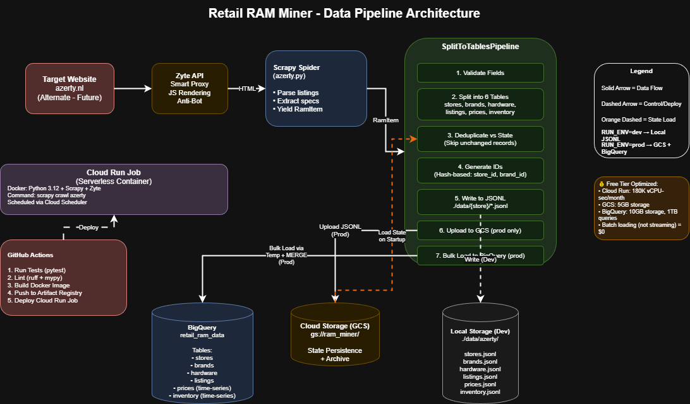
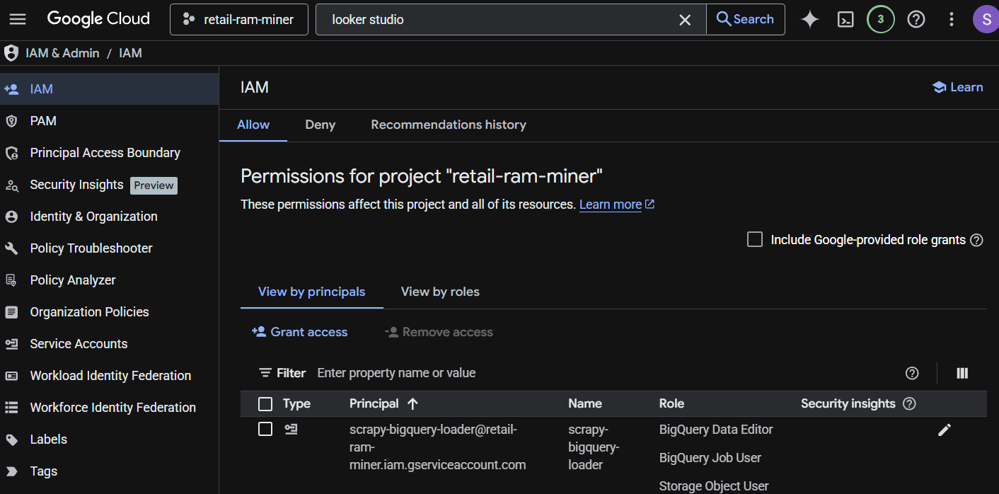
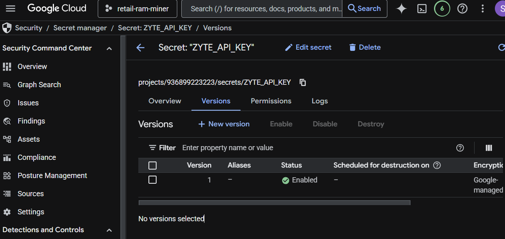
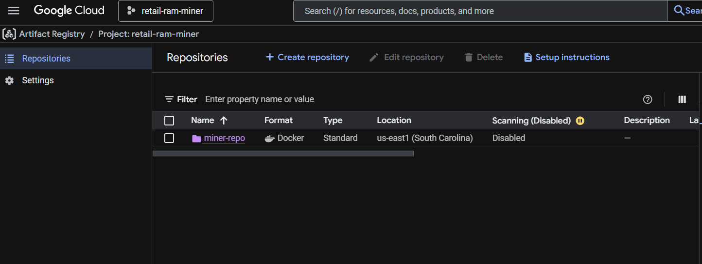
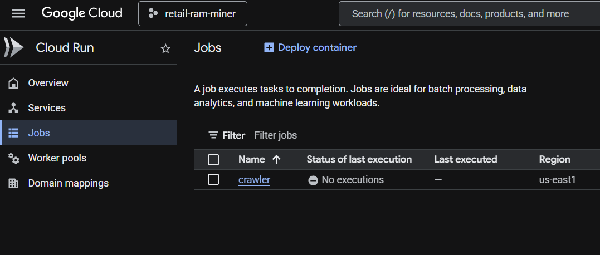
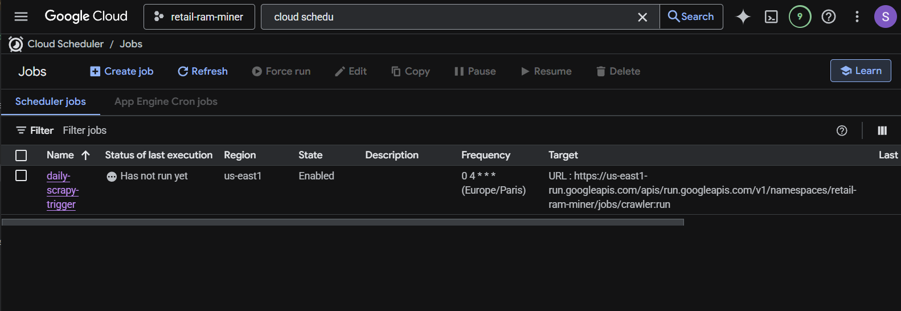
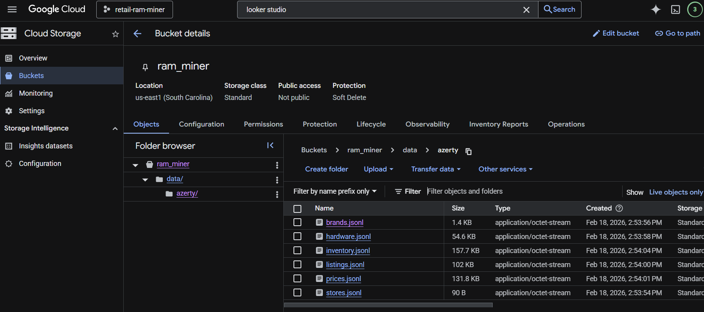
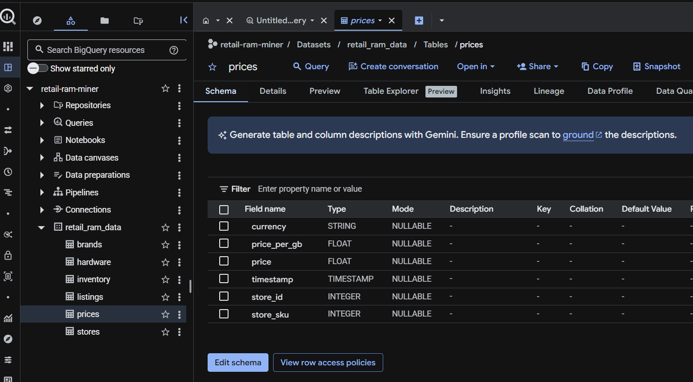
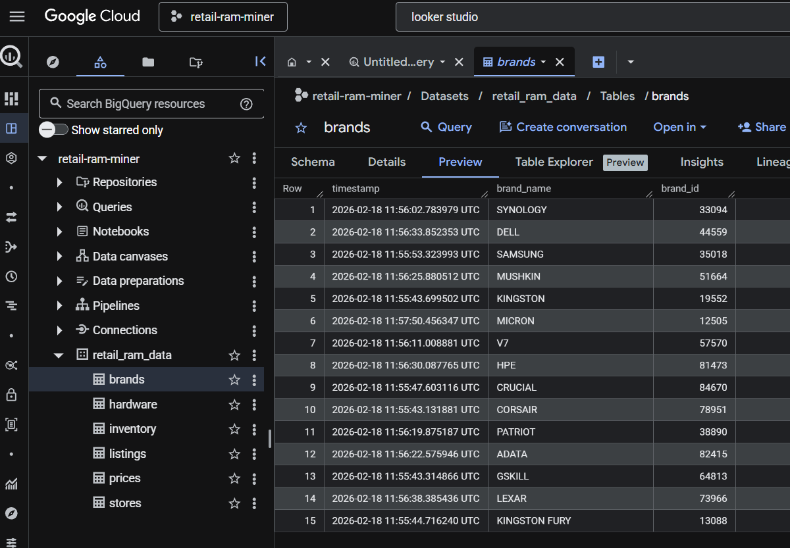

# Retail RAM Miner

Automated price monitoring and analysis for RAM across major retailers. This is a **small practice project** designed to demonstrate web scraping, data pipeline architecture, and cloud deployment—all within the **GCP Free Tier**.

## Table of Contents

- [Project Scope](#project-scope)
- [Overview](#overview)
- [Architecture](#architecture)
  - [Data Flow Diagram](#data-flow-diagram)
  - [Scrapy Pipeline Architecture](#scrapy-pipeline-architecture)
  - [State Management & Deduplication](#state-management--deduplication)
  - [Design Decisions & Trade-offs](#design-decisions--trade-offs)
  - [Technology Stack](#technology-stack)
- [Prerequisites & Local Setup](#prerequisites--local-setup)
- [Google Cloud Setup & Deployment](#google-cloud-setup--deployment)
  - [GCP Infrastructure Setup](#1-gcp-infrastructure-setup)
  - [Create Service Account](#create-service-account-for-the-scraper)
  - [Setup Secrets in Google Cloud](#setup-secrets-in-google-cloud)
  - [Build & Push Container](#2-build--push-container)
  - [Create Cloud Run Job](#3-create-cloud-run-job)
  - [Setup Cloud Scheduler (Optional)](#4-setup-cloud-scheduler-optional)
- [CI/CD (GitHub Actions)](#cicd-github-actions)
  - [Setup GitHub Secrets & Variables](#setup-github-secrets--variables)
- [Results & Validation](#results--validation)
- [Troubleshooting](#troubleshooting)
- [License](#license)

## Project Scope

Currently implemented:
- ✅ **Azerty.nl** - Fully functional crawler with complete test coverage

Future expansion opportunities:
- ⏸️ **Alternate.nl** - Spider structure exists but is deliberately incomplete for practice/learning purposes

> **Note**: The Alternate spider is intentionally left unfinished as an exercise for future development or for external contributors to practice implementing a similar scraper following the established patterns.

## Overview

- **Engine**: Scrapy (asyncio)
- **Unblocking**: Zyte API (smart proxy & browser rendering)
- **Packaging**: Docker
- **Deployment**: Google Cloud Run Job (serverless, pay-per-use)
- **Data Pipeline**: 
  - **Dev**: Local JSONL files (./data/{store_name}/)
  - **Prod**: 
    1. Scrapes data to local JSONL (in container).
    2. Uploads JSONL to Google Cloud Storage (GCS) for archival/state.
    3. Loads JSONL to **BigQuery** using a Merge (Upsert) strategy via temporary tables.

## Architecture

### Data Flow Diagram



### Scrapy Pipeline Architecture

```
┌─────────────────────────────────────────────────────────────────────┐
│  1. SCRAPY SPIDER (azerty.py)                                       │
│     - Crawls product listings                                       │
│     - Extracts raw HTML data                                        │
│     - Yields RamItem objects                                        │
└─────────────────────────────┬───────────────────────────────────────┘
                              │
                              ▼
┌─────────────────────────────────────────────────────────────────────┐
│  2. PIPELINE: SplitToTablesPipeline (pipeline.py)                   │
│                                                                     │
│  ┌─────────────────────────────────────────────────────────────┐  │
│  │ A. Item Processing (process_item)                           │  │
│  │    - Validates required fields                              │  │
│  │    - Transforms single item into 6 relational records:      │  │
│  │      • Store record (store_id, store_name, timestamp)       │  │
│  │      • Brand record (brand_id, brand_name, timestamp)       │  │
│  │      • Hardware record (mpn, brand_id, specs, capacity)     │  │
│  │      • Listing record (sku, mpn, store_id, url)             │  │
│  │      • Price record (sku, price, timestamp)                 │  │
│  │      • Inventory record (sku, stock levels, timestamp)      │  │
│  └─────────────────────────────────────────────────────────────┘  │
│                              │                                      │
│                              ▼                                      │
│  ┌─────────────────────────────────────────────────────────────┐  │
│  │ B. Deduplication (State Management)                         │  │
│  │    - Loads existing records from previous runs              │  │
│  │    - Compares new records against state                     │  │
│  │    - Only writes NEW or CHANGED records                     │  │
│  │    - Price/Inventory: Always written (time-series data)     │  │
│  └─────────────────────────────────────────────────────────────┘  │
│                              │                                      │
│                              ▼                                      │
│  ┌─────────────────────────────────────────────────────────────┐  │
│  │ C. Local Write (write_to_local)                             │  │
│  │    - Appends records to JSONL files                         │  │
│  │    - Location: ./data/{store_name}/{table}.jsonl            │  │
│  │    - 6 files: stores, brands, hardware, listings,           │  │
│  │                prices, inventory                            │  │
│  └─────────────────────────────────────────────────────────────┘  │
└─────────────────────────────┬───────────────────────────────────────┘
                              │
                              ▼
┌─────────────────────────────────────────────────────────────────────┐
│  3. CLOUD UPLOAD (RUN_ENV=prod only)                                │
│                                                                     │
│  ┌─────────────────────────────────────────────────────────────┐  │
│  │ A. GCS Upload (close_spider -> _write_to_bigquery)          │  │
│  │    - Uploads all 6 JSONL files to GCS bucket                │  │
│  │    - Path: gs://{bucket}/data/{store}/{table}.jsonl         │  │
│  │    - Overwrites existing files (latest state)               │  │
│  └─────────────────────────────────────────────────────────────┘  │
│                              │                                      │
│                              ▼                                      │
│  ┌─────────────────────────────────────────────────────────────┐  │
│  │ B. BigQuery Load (Bulk Insert via Temp Tables)              │  │
│  │    1. Create temp tables (if needed)                        │  │
│  │    2. Load JSONL into temp_{table} (load job)               │  │
│  │    3. MERGE temp into production table:                     │  │
│  │       - ON conflict: UPDATE non-null values (COALESCE)      │  │
│  │       - No conflict: INSERT new record                      │  │
│  │    4. Drop temp tables                                      │  │
│  └─────────────────────────────────────────────────────────────┘  │
└─────────────────────────────────────────────────────────────────────┘
```

### State Management & Deduplication

The pipeline uses a sophisticated state system to minimize storage costs and avoid duplicate data:

1. **On Startup** (`open_spider`):
   - Downloads existing JSONL from GCS (if RUN_ENV=prod)
   - Loads into in-memory dictionaries (by unique keys)
   - Tracks: stores, brands, hardware, listings

2. **During Scraping** (`process_item`):
   - Checks each record against existing state
   - **Dimensional Tables** (stores, brands, hardware, listings):
     - Only writes if NEW or CHANGED
     - Uses unique keys: store_id, brand_id, mpn, sku
   - **Fact Tables** (prices, inventory):
     - Always writes (time-series data)
     - Deduplication: Only inserts if price/stock differs from last record

3. **On Completion** (`close_spider`):
   - Uploads JSONL to GCS (overwrites)
   - Bulk loads to BigQuery via MERGE
   - Result: No duplicates, only new/changed data

### Design Decisions & Trade-offs

#### Why JSONL Instead of Direct BigQuery Streaming?

1. **Cost**: Streaming inserts have per-row costs; batch loading from GCS is free (within free tier)
2. **Deduplication**: JSONL allows local deduplication before upload, reducing BQ processing
3. **State Preservation**: GCS acts as persistent storage for state between Cloud Run Job executions
4. **Debugging**: Human-readable JSONL files make it easy to inspect data issues

#### Why Cloud Run Job Instead of Cloud Functions?

1. **Execution Time**: Scrapy crawls can take 5-15 minutes; Cloud Functions timeout at 9 minutes
2. **Memory**: Run Jobs can allocate up to 4GB; Functions limited to 2GB
3. **Cost**: Jobs are billed by actual usage (seconds); perfect for infrequent scheduled tasks
4. **Control**: Full container control allows custom dependencies (Scrapy, Zyte, etc.)

#### Why Separate Tables (Normalization)?

- **Analytical Queries**: Joins are cheap in BigQuery (columnar storage)
- **Storage Efficiency**: Avoid repeating brand/store names in every row
- **Time-Series Analysis**: Price/inventory history in separate tables enables trend analysis
- **Data Integrity**: Changes to brand/store metadata don't require re-scraping all products

#### Free Tier Considerations

This project is designed to stay within GCP free tier limits:
- **Cloud Run**: 180,000 vCPU-seconds/month free → ~50 hours of jobs
- **Cloud Storage**: 5GB free → More than enough for JSONL archives
- **BigQuery**: 1TB queries/month free, 10GB storage free → Perfect for this dataset
- **Zyte API**: $10-50/month depending on crawl frequency (external service)

### Technology Stack

| Component | Technology | Purpose |
|-----------|-----------|---------|
| **Scraping** | Scrapy 2.14+ | Async web crawling framework |
| **Anti-Bot** | Zyte API | Proxy rotation, JS rendering, CAPTCHA solving |
| **Data Validation** | Pydantic-like Items | Schema enforcement |
| **Storage (Dev)** | JSONL files | Local development & testing |
| **Storage (Prod)** | GCS + BigQuery | Scalable cloud data warehouse |
| **Orchestration** | Cloud Scheduler + Run Jobs | Scheduled serverless execution |
| **CI/CD** | GitHub Actions | Automated testing & deployment |
| **Testing** | Pytest + Mock | Unit tests with 95%+ coverage |
| **Code Quality** | Ruff + Mypy | Linting & strict type checking |

## Prerequisites & Local Setup

### 1. Environment Configuration

Create a `.env` file or set environment variables.

```powershell
ZYTE_API_KEY=your_zyte_key_here
# Google Cloud Configuration
GCP_PROJECT_ID=your_project_id
GCP_DATASET_ID=retail_ram_data       # BigQuery Dataset ID
GCP_BUCKET_NAME=your_gcs_bucket_name # GCS Bucket for JSONL storage
# Application Settings
RUN_ENV=dev                          # 'dev' (local output) or 'prod' (GCS + BigQuery)
GOOGLE_APPLICATION_CREDENTIALS=path/to/your/service-account-key.json # Required for local testing of prod features
```

### 2. Install dependencies and run a crawl

```powershell
# Install dependencies from pinned requirements
uv pip install -r requirements.txt

# Run a local test crawl
scrapy crawl azerty
```

### 3. Linting & Type Safety

Ruff handles formatting/linting. Mypy enforces strict typing.

```powershell
# Run all checks
ruff check .
mypy ram_miner/
```

## Google Cloud Setup & Deployment

### 1. GCP Infrastructure Setup

**Required APIs:**
- **Cloud Run API** (`run.googleapis.com`) - For running serverless jobs
- **Cloud Scheduler API** (`cloudscheduler.googleapis.com`) - For scheduled execution
- **Artifact Registry API** (`artifactregistry.googleapis.com`) - For Docker image storage
- **Cloud Storage API** (`storage.googleapis.com`) - For JSONL file storage
- **BigQuery API** (`bigquery.googleapis.com`) - For data warehouse
- **Secret Manager API** (`secretmanager.googleapis.com`) - For secure credential storage
- **IAM API** (`iam.googleapis.com`) - For service account management

Before deploying, ensure the following resources exist in your Google Cloud Project:

1.  **Project**: Create a GCP Project (e.g. retail-ram-miner).
2.  **Storage**: Create a **Cloud Storage Bucket** (e.g., `ram_miner`) to store raw JSONL files.
3.  **BigQuery**: Create a **BigQuery Dataset** (e.g., `retail_ram_data`).
    *   *Note: Tables (`stores`, `brands`, `hardware`, `listings`, `prices`, `inventory`) will be auto-created by the pipeline if they don't exist.*
4.  **Artifact Registry**: Create a Docker repository (e.g., `miner-repo`) in your region.
5.  **Service Account**: Create a Service Account (e.g., `scrapy-bigquery-loader`) with the following IAM roles:
    *   `Storage Object User` (Write/Read/Delete to GCS)
    *   `Secret Manager Secret Accessor` (Read secrets)
    *   `BigQuery Job User` (Run query/load jobs)
    *   `BigQuery Data Editor` (Read/Write to Dataset)
    *   `Cloud Run Invoker` (Allow Cloud Schedule to run job)

### Create Service Account for the Scraper

Before deploying, you need a service account that the Cloud Run Job will use to access GCS and BigQuery.

```bash
# Set your project
export PROJECT_ID=YOUR_PROJECT_ID
gcloud config set project $PROJECT_ID

# Create service account
gcloud iam service-accounts create scrapy-bigquery-loader \
  --display-name="Scrapy BigQuery Loader"

# Capture the service account email
SA_EMAIL="scrapy-bigquery-loader@${PROJECT_ID}.iam.gserviceaccount.com"

# Grant required roles
gcloud projects add-iam-policy-binding $PROJECT_ID \
  --member="serviceAccount:${SA_EMAIL}" \
  --role="roles/storage.objectUser"

gcloud projects add-iam-policy-binding $PROJECT_ID \
  --member="serviceAccount:${SA_EMAIL}" \
  --role="roles/bigquery.jobUser"

gcloud projects add-iam-policy-binding $PROJECT_ID \
  --member="serviceAccount:${SA_EMAIL}" \
  --role="roles/bigquery.dataEditor"

gcloud projects add-iam-policy-binding $PROJECT_ID \
  --member="serviceAccount:${SA_EMAIL}" \
  --role="roles/secretmanager.secretAccessor"

gcloud projects add-iam-policy-binding $PROJECT_ID \
  --member="serviceAccount:${SA_EMAIL}" \
  --role="roles/run.invoker"
```

**Result**: Your service account should look like this in the GCP Console:



### Setup Secrets in Google Cloud

Store your Zyte API key in Google Secret Manager so the Cloud Run Job can access it securely:

```bash
# Enable Secret Manager API (if not already enabled)
gcloud services enable secretmanager.googleapis.com

# Create the secret
echo -n "YOUR_ZYTE_API_KEY" | gcloud secrets create zyte-api-key \
  --data-file=- \
  --replication-policy="automatic"
```

**Result**: Your secret should appear in Secret Manager:



### 2. Build & Push Container

```powershell
# Authenticate Docker with Artifact Registry
gcloud auth login

gcloud confi set project [YOUR_PROJECT_ID]

gcloud auth configure-docker us-east1-docker.pkg.dev

# Build & push image
docker compose build
docker push us-east1-docker.pkg.dev/[PROJECT_ID]/[REPO_NAME]/[IMAGE_NAME]:latest

# In our case
docker push us-east1-docker.pkg.dev/retail-ram-miner/miner-repo/crawler:latest
```

**Result**: Your Docker image should appear in Artifact Registry:



### 3. Create Cloud Run Job

Create the job with the necessary environment variables. The job executes the Scrapy spider.

```powershell
gcloud run jobs deploy [JOB_NAME] \
    --image [REGION]-docker.pkg.dev/[PROJECT_ID]/[REPO_NAME]/[IMAGE_NAME]:latest \
    --tasks 1 \
    --parallelism 1 \
    --region [REGION] \
    --service-account scrapy-bigquery-loader@[PROJECT_ID].iam.gserviceaccount.com \
    --command scrapy \
    --args crawl,azerty \
    --memory 1Gi \
    --set-env-vars RUN_ENV=prod,GCS_BUCKET_NAME=[BUCKET_NAME],GCP_PROJECT_ID=[PROJECT_ID],GCP_DATASET_ID=[DATASET_ID] \
    --max-retries 0
```

**Result**: Your Cloud Run Job should appear in the console:



### 4. Setup Cloud Scheduler (Optional)

The cd github action already triggers a schedule in cloud run, but if you want to set up a separate schedule to run the scraper automatically, you can create a Cloud Scheduler job:

```bash
# Enable Cloud Scheduler API (if not already enabled)
gcloud services enable cloudscheduler.googleapis.com

# Create a scheduler job to run daily at 2 AM
gcloud scheduler jobs create http crawler-daily-job \
    --location=[REGION] \
    --schedule="0 2 * * *" \
    --uri="https://[REGION]-run.googleapis.com/apis/run.googleapis.com/v1/namespaces/[PROJECT_ID]/jobs/[JOB_NAME]:run" \
    --http-method=POST \
    --oauth-service-account-email=[SERVICE_ACCOUNT_EMAIL]

# Example:
gcloud scheduler jobs create http crawler-daily-job \
    --location=us-east1 \
    --schedule="0 2 * * *" \
    --uri="https://us-east1-run.googleapis.com/apis/run.googleapis.com/v1/namespaces/retail-ram-miner/jobs/crawler:run" \
    --http-method=POST \
    --oauth-service-account-email=scrapy-bigquery-loader@retail-ram-miner.iam.gserviceaccount.com
```

**Result**: Your scheduled job should appear in Cloud Scheduler:



## CI/CD (GitHub Actions)

- Test: `pytest` with mocked HTTP responses
- Lint: Ruff checks formatting and unused imports
- Build: Python 3.12-slim Docker image
- Deploy: Push to Artifact Registry and update Cloud Run Job
- **Pipeline Strategy**:
  - Writes to GCS and BigQuery only on `RUN_ENV=prod`.
  - Uses **Temp Tables + MERGE** in BigQuery to deduplicate data (Upsert) based on unique keys (e.g., `store_id`, `sku`, `timestamp`).

### Setup GitHub Secrets & Variables

#### How to create the GCP service account and key for GitHub Actions:

```bash
# Set your project (if not already)
gcloud config set project YOUR_PROJECT_ID

# Create a service account for GitHub CD
gcloud iam service-accounts create github-cd-sa \
  --display-name="GitHub CD SA"

# Capture the service account email
SA_EMAIL="github-cd-sa@YOUR_PROJECT_ID.iam.gserviceaccount.com"

# Set project id
export PROJECT_ID=YOUR_PROJECT_ID

# Grant required roles to the service account
gcloud projects add-iam-policy-binding $PROJECT_ID --member="serviceAccount:${SA_EMAIL}" --role="roles/run.jobsExecutor"
gcloud projects add-iam-policy-binding $PROJECT_ID --member="serviceAccount:${SA_EMAIL}" --role="roles/cloudscheduler.admin"
gcloud projects add-iam-policy-binding $PROJECT_ID --member="serviceAccount:${SA_EMAIL}" --role="roles/iam.serviceAccountUser"
gcloud projects add-iam-policy-binding $PROJECT_ID --member="serviceAccount:${SA_EMAIL}" --role="roles/artifactregistry.writer"
gcloud projects add-iam-policy-binding $PROJECT_ID --member="serviceAccount:${SA_EMAIL}" --role="roles/run.developer"

# Create a JSON key locally (outputs a file named sa-key.json)
gcloud iam service-accounts keys create sa-key.json \
  --iam-account="${SA_EMAIL}"

# Print the key so you can copy it into the GitHub secret
cat sa-key.json
# IMPORTANT: Copy the FULL JSON content into the GitHub secret (not just the private_key field)
```
After adding the variables and secret, your workflow will reference them as:

- Variables: `${{ vars.GCP_PROJECT_ID }}`, `${{ vars.GCP_REGION }}`, `${{ vars.GCP_REPO_NAME }}`,
  `${{ vars.GCP_IMAGE_NAME }}`, `${{ vars.GCP_BUCKET_NAME }}`, `${{ vars.GCP_JOB_NAME }}`
- Secret: `${{ secrets.GCP_SA_KEY }}`


#### Env variables to set for GitHub Actions:
* GCP_PROJECT_ID: Your Google Cloud Project ID (e.g. retail-ram-miner)
* GCP_REGION: Deployment region (e.g., us-east1)
* GCP_REPO_NAME: Artifact Registry repository name (e.g. miner-repo)
* GCP_IMAGE_NAME: Container image name (e.g.,crawler)
* GCP_JOB_NAME: Cloud Run Job name (e.g. crawler)
* GCP_BUCKET_NAME: Cloud Storage bucket name (e.g. ram-miner)
* GCP_DATASET_ID: BigQuery dataset id (e.g. retail_ram_data)

#### Secrets to set for GitHub Actions:
* GCP_SA_KEY: The full JSON content of the service account key you created (copy the output of `cat sa-key.json` into this secret). 
This will be used by the GitHub Action to authenticate with GCP and deploy the Cloud Run Job.

## Results & Validation

Once the scraper runs successfully, you can verify the data in Google Cloud:

### 1. Cloud Storage Bucket

The JSONL files are uploaded to your GCS bucket after each run:



Each store has its own directory with 6 JSONL files:
- `stores.jsonl` - Store metadata
- `brands.jsonl` - Brand information
- `hardware.jsonl` - Product specifications
- `listings.jsonl` - Store-specific product listings
- `prices.jsonl` - Price history (time-series)
- `inventory.jsonl` - Stock levels (time-series)

### 2. BigQuery Tables

Data is loaded into BigQuery with proper schemas and relationships:

**Table Schema Example (Prices Table)**:



**Query Results Example (Brands Table)**:



### 3. Sample BigQuery Queries

```sql
-- Get latest prices for all RAM products
SELECT 
  h.brand_name,
  h.model_name,
  h.capacity_gb,
  l.store_name,
  p.price,
  p.price_per_gb,
  p.timestamp
FROM `retail_ram_data.prices` p
JOIN `retail_ram_data.listings` l ON p.sku = l.sku
JOIN `retail_ram_data.hardware` h ON l.mpn = h.mpn
WHERE p.timestamp = (
  SELECT MAX(timestamp) 
  FROM `retail_ram_data.prices` 
  WHERE sku = p.sku
)
ORDER BY p.price_per_gb ASC
LIMIT 10;

-- Track price changes over time
SELECT 
  sku,
  price,
  timestamp,
  LAG(price) OVER (PARTITION BY sku ORDER BY timestamp) as previous_price,
  price - LAG(price) OVER (PARTITION BY sku ORDER BY timestamp) as price_change
FROM `retail_ram_data.prices`
WHERE sku = 'YOUR_SKU_HERE'
ORDER BY timestamp DESC;

-- Check inventory availability across stores
SELECT 
  l.store_name,
  h.brand_name,
  h.model_name,
  i.availability,
  i.stock_store,
  i.stock_supplier,
  i.timestamp
FROM `retail_ram_data.inventory` i
JOIN `retail_ram_data.listings` l ON i.sku = l.sku
JOIN `retail_ram_data.hardware` h ON l.mpn = h.mpn
WHERE i.timestamp = (
  SELECT MAX(timestamp) 
  FROM `retail_ram_data.inventory` 
  WHERE sku = i.sku
)
AND h.brand_name = 'CORSAIR'
ORDER BY i.stock_store DESC;
```

## Troubleshooting

- **403 Forbidden (GCS/BigQuery)**: Check Service Account permissions. It needs access to both the specific Bucket and the Dataset.
- **Merge Errors**: Ensure `MERGE_KEYS` are correctly defined in `settings.py` for each table.
- **ModuleNotFoundError**: Missing `__init__.py` or `setup.py` issues.
- **MemoryLimitExceeded**: Increase Cloud Run Job memory (e.g., `2Gi` -> `4Gi`).

## License

See `LICENSE` for details.
